# Projektbeschreibung 
Im Rahmen der Lehrveranstaltung Softwaredesign wurde dieses Projekt entwickelt, welches eine interaktive Web-Anwendung zur Modellierung, Simulation und Topologieoptimierung mechanischer 2D-Strukturen enthält.

Die Struktur wird anhand der Anleitung als Feder-Knoten-Modell aufgebaut, bestehend aus: 
- Knoten (2 Freiheitsgrade in x- und z-Richtung)
- Federn zwischen den Knoten (horizontal, vertikal und diagonal)
- Randbedingungen (Festlager / Loslager)
- Extern eingeleiteten Kräften 

Die Anwendung erlaubt grundsätzlich: 
- Aufbauen und Visualisieren einer Gitterstruktur
- Setzen von Kräften und Lagern 
- Lösen des Gleichungssystems `K * u = F`
- Visualisierung der Verformung
- Visualisierung des Lastpfads 
- Visualisierung unterschiedlicher Heatmaps
- Iterative Topologieoptimierung mit adaptivem Rollback 
- Topologieoptimierung mittels Dijkstra-Algorithmus (Kraftbasiert)
- Topologieoptimierung Energiebasiert
- Speichern, Laden und weiterarbeiten von optimierten Strukturen (TinyDB + Pickle)
- Optionaler GIF-Export eines Optimierungsverlaufs 
- Downloads der Strukturen als .png
- Vergleich einer Referenz- und einer Aktuellen-Struktur 

Die ganze Anwendung wir vollständig mit Streamlit umgesetzt. 

# Messerschmitt-Bölkow-Blohm Balken
Die mit der Anwenung erzeugten MBB-Balken werden wie unten angeführt erstellt. Für jeden Balken wird nach der Optimierung `Solve` ausgeführt, die `Skalierung Deformation` auf 0.5 eingestellt und der Heatmap-Modus `Federenergie`angewählt. 

Für die Struktur jedes Balkens gilt: 
- `Geometrie / Lager` (Struktur)
    - `Anzahl Knoten in x`: 101 
    - `Anzahl Knoten in z`: 30  
    - `Lager (Start)`: Knoten einzeln 
    - Default-Kraft so gelassen 
    - Default-Lager so gelassen 

Der erste MBB-Balken wird mit folgenden Optimierungsparametern erzeugt: 
- `Optimierungsstrategie` --> Energiebasiert (lokal)
- `Ziel-Massenanteil` --> 0.50
- `Max. Iterationen`--> 30
- `max_entfernen_pro_iter`--> 60
- `u_faktor`--> 2.0

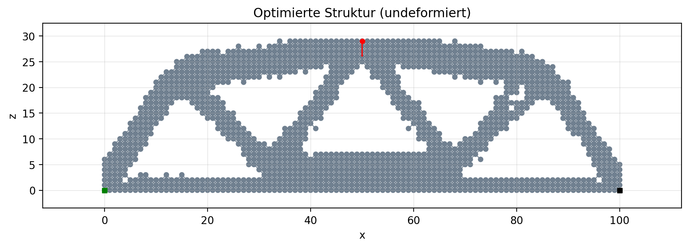

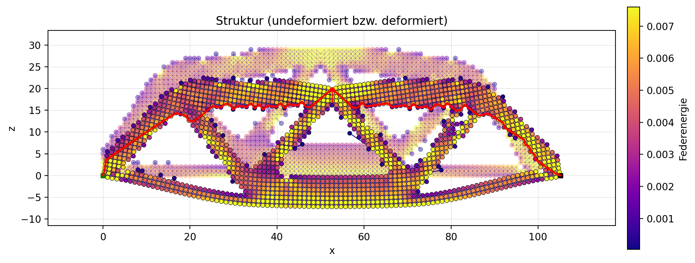

Der zweite MBB-Balken wird mit folgenden Optimierungsparametern erzeugt: 
- `Optimierungsstrategie` --> Dijkstra-Lastpfad (global geschützt)
- `Pfad-Schutz (Nachbarschaft)` --> 0
- `Ziel-Massenanteil` --> 0.50
- `Max. Iterationen`--> 30
- `max_entfernen_pro_iter`--> 60
- `u_faktor`--> 2.0

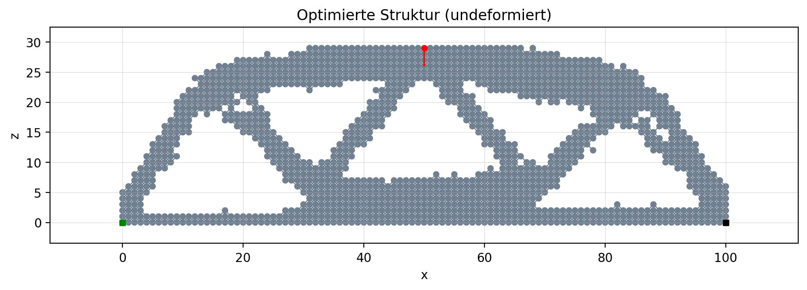

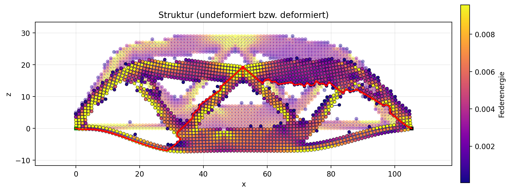

Der dritte MBB-Balken wird mit folgenden Optimierungsparametern erzeugt: 
- `Optimierungsstrategie` --> Dijkstra-Lastpfad (global geschützt)
- `Pfad-Schutz (Nachbarschaft)` --> 2
- `Ziel-Massenanteil` --> 0.50
- `Max. Iterationen`--> 30
- `max_entfernen_pro_iter`--> 60
- `u_faktor`--> 2.0

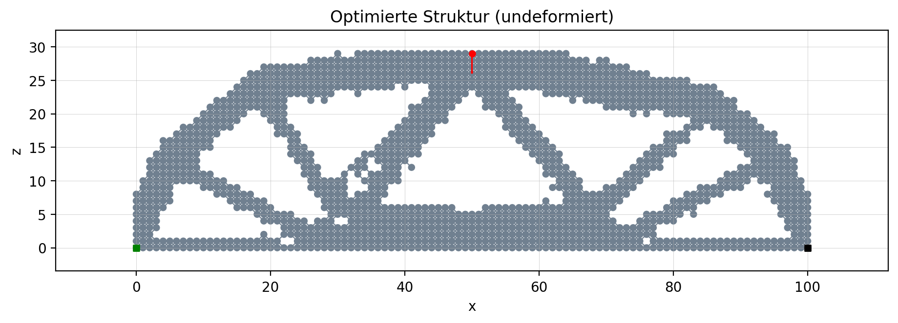

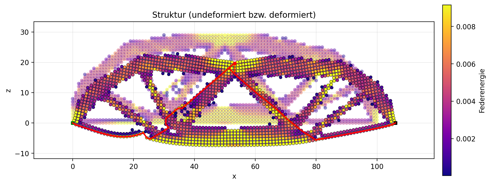

Die erzeugten Balken sehen insgesamt sinnvoll aus, da sich das Material vof allem in den tragenden Bereichen befindet. Gleichzeitig werden auch Unterschiede zwischen den beiden Optimierungsstrategien gut sichtbar. 

# Installation 
Um mit dem Anwenung arbeiten zu können gibt es zwei verschiedene möglichkeiten. 

Die erste Möglichkeit ist hierbei das ganze Repo zu Klonen, man kann selbst am Code weiter arbeiten und weiter optimieren. Dies Funktioniert so:
- Repository Klonen: 
    - git clone https://github.com/LeonSei03/Mechanische-Strukturen-simulieren-und-optimieren.git
    - cd Mechanische-Strukturen-simulieren-und-optimieren
    - code . 
- Virtuelle Umgebung im z.B im Terminal erstellen:
    - python -m venv .venv 
    - .venv/Scripts/activate (Windows)
- Alle nötigen packages installieren: 
    - pip install -r requirements.txt
- Anwendung starten: 
    - streamlit run ui.py 

Für die zweite Möglichkeit um mit der Anwendung arbeiten zu können muss man lediglich diesem Link folgen: https://mechanische-strukturen-simulieren-und-optimieren.streamlit.app. Allerdings kann man hierbei keinen Code ändern/überarbeiten sondern nur mit dem bereits vorhandenem UI interagieren.  
# Anleitung UI 
## Sidebar
Die Sidebar links enthält Einstellungen, welche tabübergreifend wirken. 
#### Geometrie / Lager 
- `nx` / `nz`: Anzahl der Knoten in x- und z-Richtung
- `dx` / `dz` Knotenabstand (Geometrie)
- `Lager (Start)`
    - Knoten einzeln: setzt Default-Lager auf zwei Knoten (links unten Festlager, rechts unten Loslager)
    - Knotenspalte: setzt die ganze linke Spalte als Feslager
- `Neue Struktur erzeugen`: erstellt eine neue Default-Struktur und setzt UI-Entwürfe/Erbenisse zurück 

#### Darstellung
- `Skalierung Deformation`: verstärkt/verkleinert die sichtbare deformierte Form (nur sichtbar nach `Solve`)
- `Federn anzeigen`: zeichnet die Federn 
- `Knoten-IDs anzeigen`: blendet die Knoten IDs im Plot ein
- `Legende anzeigen`: blendet die Marker-Legende ein und aus (Lager/Kraftknoten)
- `Lastpfad anzeigen`: zeigt (falls vorhanden) den Lastpfad im Plot 

#### Heatmap 
- `Keine`: normale Darstellung 
- `Verschiebung (Knoten)`: färbt nach Betrag der Verschiebung (nur nach `Solve` sichtbar)
- `Federenergie` / `Federkraft`: färbt Federn/Knoten nach Energie bzw. Kraft (nur nach `Solve` sichtbar)
- Hinweis: Bei `Federenergie` / `Federkraft` werden die Federn automatisch eingeblendet, auch wenn die Checkbox aus ist.

## Tab Ansicht 
Bei Start der Anwendung wird automatisch eine Default-Struktur erzeugt mit der man sofort arbeiten kann: 
- Default-Kraft wirkt mittig oben nach unten (bei geradem nx auf zwei Knoten verteilt)
- Default-Lager: je nach `Lager (Start)` in der Sidebar 

#### Workflow: Struktur definieren -> Anwenden -> Lösen
1. Struktur erstellen (Sidebar --> `Neue Struktur erzeugen`)
2. Kräfte & Lager entwerfen (Editor-Bereich)
    - Man wählt eine Knoten-ID und setzt Werte
    - Mit `In Entwurf speichern` landen Entwürfe erst in einer Entwurftabelle (noch nicht in der Struktur)
3. `Entwürfe auf Struktur anwenden`
    - Erst jetzt werden alle Entwürfe wirklich in die Struktur übernommen 
4. `Solve` ganz unten in Ansicht  
    - Löst das System und zeigt die deformierte Struktur (abhängig von `Skalierung Deformation`)

#### Kräfte-Editor 
- `In Entwurf speichern`: merkt sich Kraftwerte für den gewählten Knoten (Entwurfsliste wird darunter angezeigt)
- `Aus Entwurf löschen`: entfernt den Kraft-Entwurf und löscht die Kraft auch aus der Struktur 
- `Alle Kräfte entfernen`: setzt alle vorhandenen Kräfte auf 0 

#### Lager-Editor 
- `Setzmodus` 
    - Knoten einzeln: nur ausgewählte Knoten setzen 
    - Knotenspalte: setzt/entfernt Lager für die gesamte Spalte des ausgewählten Knotens
- Lagertyp welchen man will auswählen
- `In Entwurf speichern`: merkt sich die Lagerbedinung für ausgewählten Knoten/Knotenspalte (Entwursliste wird darunter angezeigt)
- `Aus Entwurf löschen`: entfernt den Lager-Entwurf für Knoten/Knotenspalte je nachdem was ausgewählt ist
- `Alle Lager entfernen`: entfernt alle vorhandenen Lager aus der Struktur 

Mit dem Button `Default ...` werden alle eingenen entwürfe gelöscht und die Default-Struktur wird wiederhergestellt. 

## Tab Optimierung 
Hier wird eine Topologieoptimierung durchgeführt, mit dem Ziel die aktive Masse (1 Knoten = 1 kg) zu reduzieren

1. `Optimierung initialisieren` 
- Strategie 
    - Energiebasiert (lokal) 
    - Dijkstra-Lastpfad (global geschützt), mit "Pfad-Schutz(Nachbarschaft)
- Ziel-Massenanteil z.B 0,50 wählen -> Hälfte der Startmasse behalten 
- Max. Iterationen, max_entfernen_pro_iter, u_faktor (Rollback/Limit-Parameter)
- Button `Optimierung initialisieren` übernimmt alle eingestellten Parameter 

2. Optimierung laufen lassen 
- `Weiter (1 Schritt)`: genau eine Iteration 
- `Auto-Weiter` / `Stop`: iteriert automatisch pro UI-Rerun, Stop hält nach dem aktuellen Schritt an 
- `Optimierung komplett durchlaufen (schnell)`: läuft ohne Stop-Möglichkeiten bis zum Ende 

### Checkpoints (Speichern / Laden)
- `Speichern`: speichert den Optimierten-Zustand als Checkpoint inklusive Paramter/Info 
- `Laden / Fortsetzen`: lädt einen ausgewählten Checkpoint und man kann die Optimierung fortsetzen 
- `Checkpoint löschen`: löscht den ausgewählten Checkpoint 
### GIF Recording 
- `GIF Recording aktiv`: zeichnet während der Optimierung Frames auf 
- Danach: FPS wählen --> GIF erstellen --> Download 

## Tab Verlaufplots 
Zeift Verlauf über Iteration: 
- Gesamtenergie
- Materialanteil 
- Aktive Knoten 
- maximale Verschiebung vs. Grenze 

## Tab Vergleich 
Vergleich von Referenz-Struktur vs. Aktuell: 
- Button `Aktuelle Struktur als Referenz speichern` speichert eine Kopie der aktuellen Struktur 
- Checkbox `Deformierte Struktur anzeigen` blendet (falls Solve vorhanden) die deformierte Struktur ein

# Implementierte Erweiterungen
### Heatmap-Visualisierung für Verschiebung, Federenergie und Federkraft 
Die Heatmap ist eine Erweiterung zur anschaulicheren Visualisierung und Auswertung der Struktur. In den drei verschiedenen Modi 
- `Verschiebung` 
- `Federenergie` 
- `Federkraft`
werden unterschiedliche Eigenschaften der berechneten Lösung farblich hervorgehoben. Somit erkennt man auf einen Blick, welche Bereiche besonders stark verformt oder belastet sind. 
Folgende Abbildung zeigt die gelöste Default Struktur im Modus `Verschiebung`

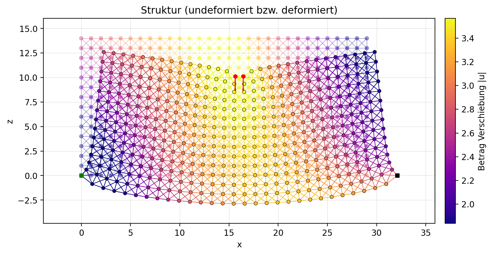

### Verschiedene Optimierungsstrategien
1. Energie-basiert 

Die erste Strategie basiert auf der in den Federn gespeicherten elastischen Energie. 
Dabei wird die Gesamtenergie jeder aktiven Feder berechnet und zur Hälfte auf die zugehörigen 
Knoten verteilt. Knoten mit geringer energetischer Beteiligung gelten als strukturell weniger 
relevant und werden bevorzugt entfernt. 
Dieser Ansatz folgt dem physikalischen Prinzip, dass sich Lastpfade bevorzugt dort ausbilden, 
wo hohe Spannungs- bzw. Energiezustände auftreten. Bereiche mit geringer Energie tragen 
wenig zur globalen Steifigkeit bei und können daher als „Materialüberschuss“ interpretiert 
werden und entfernt werden. 

Vorteil: 
- lokal sensitiv gegenüber Spannungszuständen 
- erzeugt organische, lastangepasste Strukturen 

Nachteil: 
- kann bei sehr feinen Gittern lokal instabil wirken 
- berücksichtigt keine globale Pfadstruktur explizit 

2. Dijstra-basiert

Als Erweiterung wurde eine weitere Methode der Topologieoptimierung implementiert, welche 
zuvor in Teilen in der Lehrveranstaltung durchgenommen wurde. 
Hier wird aus den aktuell berechneten Federkräften ein gewichteter Graph aufgebaut. Mittels 
eines Dijkstra-Algorithmus wird ein bevorzugter Lastpfad vom Lastknoten zum Lagerknoten 
bestimmt durch eine Kostenfunktion. 
Die Kantengewichte werden so definiert, dass stark belastete Federn einen **günstigen** Weg 
darstellen. Dadurch wird der strukturell wichtigste Kraftfluss explizit identifiziert. 
Zusätzlich wurde eine Nachbarschaftserweiterung (Ring) implementiert, um nicht nur einen 
einzelnen dünnen Pfad zu schützen, sondern einen strukturell robusteren Laststrang zu 
erhalten. Der Hauptstrang würde sonst aus nur einer Reihe an Knoten bestehen und somit kann 
man den Hauptstrang etwas „verbreitern“. Ein Vorteil dessen ist, dass globale 
Strukturzusammenhänge berücksichtig werden. 
Diese Erweiterung zeigt, dass Topologieoptimierung nicht nur lokal-energetisch, sondern auch 
graphentheoretisch interpretiert werden kann und auch über die Kräfte anstatt der Energie der 
Federn laufen kann. 

### Anzeige von Lastpfad 
Zur besseren Analyse wurde der berechnete Lastpfad zusätzlich (optional )grafisch hervorgehoben. 

Dadurch wird sichtbar: 

- wie sich der Kraftfluss während der Optimierung verändert 
- ob der Haupttragpfad erhalten bleibt 
- ob kritische Verbindungen gefährdet sind

Die Visualisierung kann entweder in deformierter oder undeformierter Konfiguration erfolgen, 
um eine klare physikalische Interpretation zu ermöglichen. 
Die Darstellung ermöglicht es, das mechanische Verhalten der Struktur intuitiv 
nachzuvollziehen und die Wirkung der Optimierungsstrategie unmittelbar zu verstehen.

### Verlaufplots der Optimierung 

Während der Optimierung werden relevante Größen pro Iteration gespeichert und anschließend 
grafisch dargestellt. Dazu gehören unter anderem: 

- Materialanteil 
- maximale Verschiebung 
- Gesamtenergie der Struktur 

Diese Verlaufsdarstellungen ermöglichen: 

- Analyse der Konvergenz 
- Identifikation von Plateaus oder instabilen Zuständen 
- Bewertung der Nebenbedingungen (z. B. Verschiebungsgrenze) 

Insbesondere die Entwicklung der maximalen Verschiebung liefert wichtige Hinweise darauf, wie 
sich die globale Steifigkeit mit zunehmender Materialreduktion verändert. 

### Strukturvergleich Nebeneinader 
Der Strukturvergleich nebeneinander im Tab `Vergleich`dient dazu, um zwei Strukturen direkt nebeneinender betrachten und vergleichen zu können. Man kann jede beliebige Struktur als Referenzstruktur speichern und jeweils die später aktuelle Struktur daneben vergleichen, wodurch zum Beispiel unterschiedliche Belastungen, Lagerungen und Optimierungen direkt auffallen. 

### GIF-Export der Optimierung  
Als zusätzliche Erweiterung wurde die Erstellung eines GIF-Videos implementiert, der den 
gesamten Optimierungsprozess als Animation speichert. 
Jeder Iterationszustand wird visualisiert und anschließend zu einer fortlaufenden Animation 
zusammengefügt. Dadurch lässt sich die strukturelle Entwicklung veranschaulichen und der 
Optimierungsverlauf wird dargestellt. 

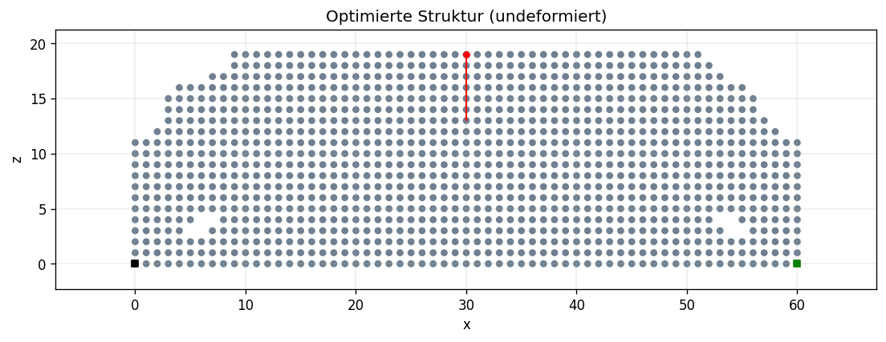

# Architektur und zentrale Abläufe 
### Architekturübersicht / Mermaid 
Das folgende Diagramm zeigt die wesentlichen Komponenten der Anwendung und ihre Beziehungen.

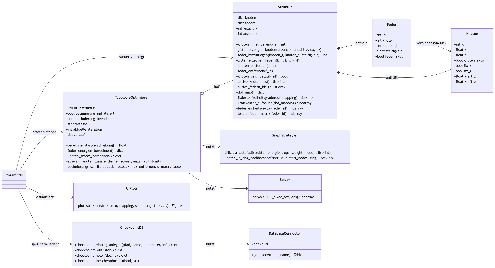

### Solve-Workflow 
Das folgende Aktivitätsdiagramm zeigt den Ablauf beim Lösen einer Struktur durch den `Solve` Button in der Benutzeroberfläche. 

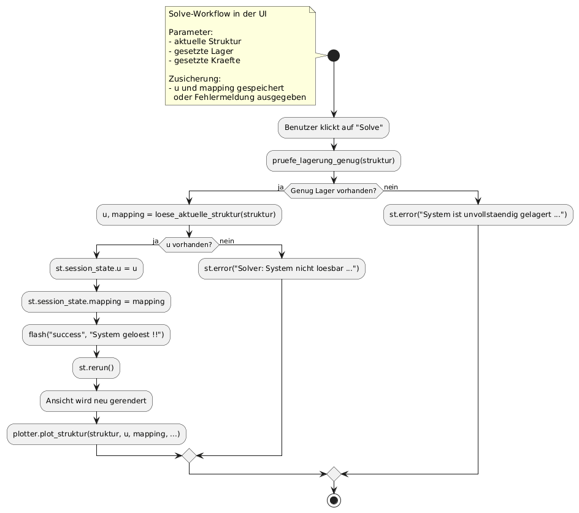

### Optimierungsschritt 
Folgendes Aktivitätsdiagramm zeigt den Ablauf eines einzelnen Optimierungsschritts. Zunächst werden Abbruchbedingungen geprüft und anschließend wird ein adaptiver Entfernungsschritt ausgeführt und das Ergebnis bewertet. 

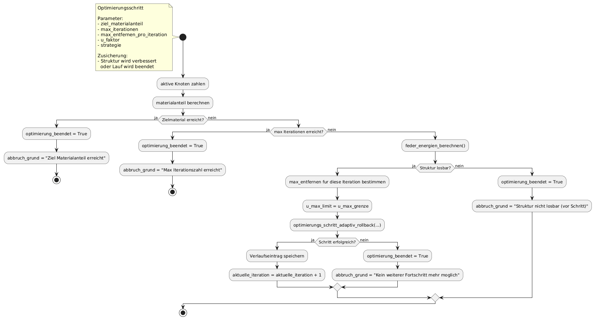

### Adaptiver Rollback-Schritt 
Folgendes Aktivitätsdiagramm beschreibt die eigentliche Kernlogik der Optimierung. Knoten werden testweise entfernt, bei Instabilität oder zu großer Verschiebung wird der vorherige Zustand per Rollback wiederhergestellt. 

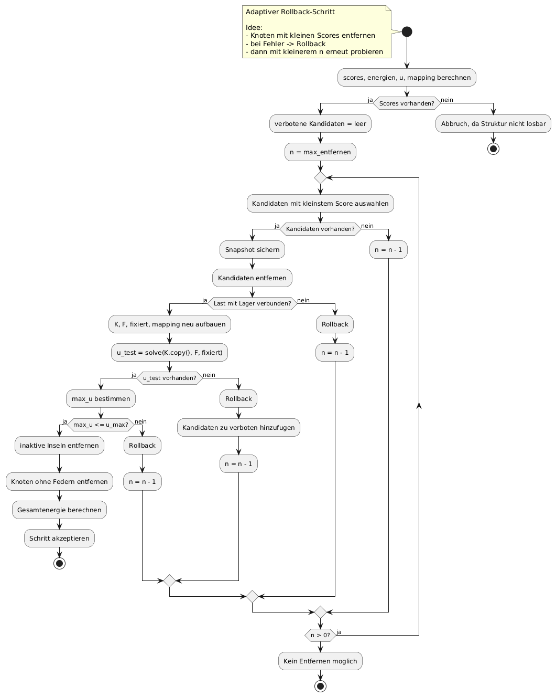

# Verwendung von Dokumentationen und KI 
Als Grundlage zum Programmieren dienten vor allem die LV-Unterlagen und Standarddokumentationen der verwendeten Tools und Bibliotheken. Ergänzend wurden KI-Werkzeuge nur vereinzelt und ausschließlich unterstützend genutzt, etwa bei Debugging oder zur allgemeinen Orientierung. Die Konzeption, Umsetzung und Programmierung des Projekts erfolgten dabei selbstständig.

### Ersteller
Dieses Projekt wurde im Rahmen des Abschlussprojekts der Lehrveranstaltung Softwaredesign von Simon Ulseß und Leon Seibert erstellt.